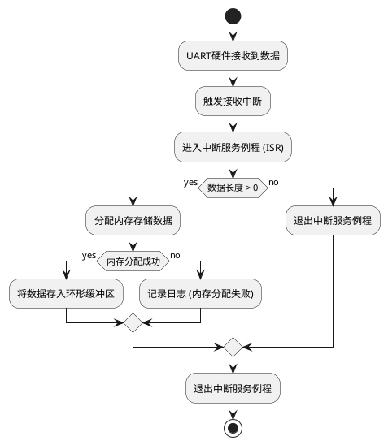

## ESP_INTR_FLAG_IRAM 的意义

### DMA 和中断处理

- DMA（Direct Memory Access） ：启用 DMA 后，UART 数据传输可以直接通过硬件完成，而无需 CPU 干预，从而提高数据传输效率。
- 中断标志 ESP_INTR_FLAG_IRAM ：
  - 将中断服务例程（ISR）放置在 IRAM（内部 RAM）中，而不是 Flash 中。
  - 这样可以避免因 Flash 缓存未命中导致的中断延迟，提升实时性。

### 适用场景

- 高波特率通信 ：如果 UART 波特率较高（如 1 Mbps 或更高），启用 DMA 和 IRAM 中断可以显著减少数据丢失的风险。
- 实时性要求 ：在需要快速响应 UART 数据的场景（如工业控制、传感器数据采集等），使用 IRAM 中断可以确保中断处理的低延迟。

### 注意事项

- 内存占用
  - 启用 DMA 和 IRAM 中断会增加内存占用：
    - DMA 需要额外的硬件资源。
    - IRAM 是有限的资源，过多的 ISR 占用可能会影响其他功能
- 兼容性
  - 确保你的硬件支持 DMA 和 IRAM 中断。大多数 ESP32 芯片都支持这些功能，但某些定制硬件可能有限制

### menuconfig 选项

设置 `ESP_INTR_FLAG_IRAM`时，需要开启 menuconfig 中的`ESP_INTR_FLAG_IRAM`选项

```shell
idf.py menuconfig
```

选项路径:

```text
Component config -> ESP-Driver:UART Configuration -> Place UART ISR function into IRAM
```

## ISR 的工作流程

以下是 uart_rx_isr_handler 的工作流程：

- 当 UART 接收到数据时，硬件触发接收中断。
- ISR 被调用，并从 UART 硬件缓冲区读取数据。
- 将读取到的数据存入环形缓冲区（xRingbuffer）。
- 主任务从环形缓冲区中读取数据并进行后续处理。



## UART 消息队列数据内存生命周期

消息队列传输的结构体定义

```c
typedef struct {
  uint8_t* data;
  size_t len;
} uart_queue_item_t;

```

### 内存生命周期管理

当在 process_ring_buffer_task 中执行以下代码时：

```c
  uart_queue_item_t queue_item = {
        .data = malloc(item_size),
        .len = item_size,
    };
    if (queue_item.data == NULL) {
      ESP_LOGE(TAG, "Failed to allocate memory for UART queue item");
      vRingbufferReturnItem(rb_handle, data);
      continue;
    }
    memcpy(queue_item.data, data, item_size);
    // 已经深拷贝过了，立即返回项给环形缓冲区
    vRingbufferReturnItem(rb_handle, data);  // 返回项给环形缓冲区
    if (xQueueSend(uart_data_queue, &queue_item, portMAX_DELAY) != pdPASS) {
      ESP_LOGE(TAG, "Failed to send message to queue");
      free(queue_item.data);
    }
```

会经历以下过程：

- 内存分配：malloc 在堆上分配了一块内存，假设地址为 0x1000。
- 数据拷贝：将环形缓冲区的数据复制到 0x1000 地址处。
- 队列发送：将 queue_item 结构体（包含指向 0x1000 的指针）浅拷贝到队列中。

此时：

- 发送方的 queue_item 是栈上的临时变量，函数退出后该结构体实例会被销毁。
- 但 0x1000 的堆内存仍然存在，因为只有消费方才有权释放它

### 为什么不会出现野指针？

FreeRTOS 的 xQueueSend 机制会完整拷贝整个结构体到队列内部存储空间。具体流程如下：

1. 队列存储的是结构体的副本：

```c
// 发送时队列内部会做类似这样的操作：
memcpy(queue_storage, &queue_item, sizeof(uart_queue_item_t));
```

- 队列内部存储的是一个新的 uart_queue_item_t 结构体，其 data 字段值仍然是 0x1000。
- 原始 queue_item 结构体（栈上的临时变量）销毁不影响队列中的副本。

2. 内存所有权转移：

- 0x1000 内存的所有权从发送方转移给队列项。
- 消费方必须在使用后调用 free()释放这块内存。

### 内存生命周期图示

```text
 发送方任务                         队列存储区                        消费方任务
+-----------------+             +-------------------+             +-----------------+
| malloc(0x1000)  |             | uart_queue_item_t |             |                  |
| 数据拷贝到0x1000|------------>| .data = 0x1000    |------------>| received_item    |
| xQueueSend       |             | .len = 128        |             | .data = 0x1000   |
+-----------------+             +-------------------+             +-----------------+
                                                                       |
                                                                       v
                                                                   free(0x1000)
```

## 测试代码

```c

    // UART TEST
    uart_queue_item_t queue_item;
    QueueHandle_t uart_data_queue = uart_get_data_queue();
    if (xQueueReceive(uart_data_queue, &queue_item, pdMS_TO_TICKS(100))) {
      size_t data_len = queue_item.len;
      // 打印接收到的数据
      ESP_LOGI(TAG, "Received data: %.*s", data_len, queue_item.data);

      // 回显数据
      uart_send_data(queue_item.data, data_len);

      free(queue_item.data);
    }
```

## 设计优点

- 模块化设计 ：
  - UART 模块的功能被清晰地划分为初始化、发送、接收和中断处理等部分，便于维护和扩展。
- 高性能 ：
  - 使用环形缓冲区和 DMA 提高了数据传输效率，适合高波特率通信。
- 实时性 ：
  - 中断服务例程（ISR）驻留在 IRAM 中，减少了中断延迟。
- 灵活性 ：
  - 提供了与 MQTT 模块交互的消息队列接口，便于与其他模块集成。
- 可靠性 ：
  - 添加了错误处理和日志记录机制，增强了代码的健壮性。
