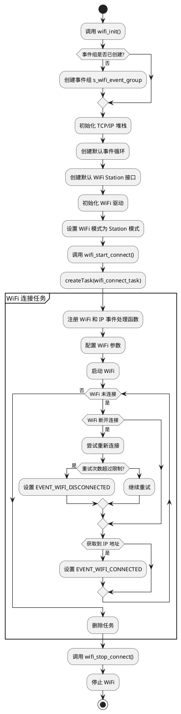

### 如何使用
```C
#include "wifi_manager.h"
#include "app_events.h"

void app_main() {
    // 初始化应用事件系统
    app_events_init();

    // 初始化并启动WiFi模块
    wifi_init_and_start();

}
```
### 调用流程图描述

- 调用 wifi_init 初始化 WiFi 模块。
- 调用 wifi_start_connect 启动 WiFi 连接任务。
- 在 WiFi 连接任务中，注册事件处理函数并启动 WiFi。
- 根据 WiFi 事件（如连接成功、断开连接等），触发相应的处理逻辑。
- 如果需要停止 WiFi，调用 wifi_stop_connect。

### PlantUML

